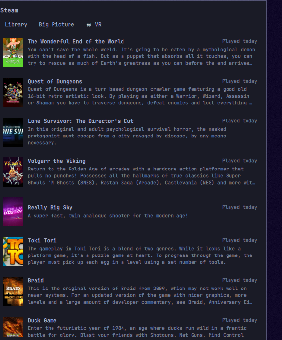

# Steam Launcher

A Steam icon for the Omarchy bar that only shows up while Steam is running. Left-click it
for a quick-launcher popup listing your installed games — box art, a short blurb, sorted by
last-played — and launch one with a single click. Right-click still gives you Steam's own
native context menu (Store, Library, Friends, Settings, Exit) as a fallback.



## Why this exists

Steam's own Linux tray icon has never implemented the left-click "Activate" call every
other tray app responds to — confirmed directly over D-Bus, its `Activate()` method is
simply not wired up. Only its right-click context menu does anything, and that menu carries
no icons or box art at all (its DBusMenu entries expose nothing but a plain text label).
This plugin gives left-click something worth doing instead: a real launcher.

## How it works

- **Installed games** come from your local `~/.local/share/Steam/steamapps/appmanifest_*.acf`
  files (filtered to drop Proton/Steam Linux Runtime/SteamVR compatibility-layer entries
  that show up alongside real games in the same folder).
- **Last-played sorting** reads Steam's own local `localconfig.vdf`
  (`~/.local/share/Steam/userdata/<your-id>/config/localconfig.vdf`) — a KeyValues/VDF file
  parsed by a small dependency-free Python script bundled in [`scripts/`](scripts). Nothing
  is sent anywhere; this is a local file read.
- **Box art** loads straight from Steam's public, keyless CDN
  (`cdn.akamai.steamstatic.com/steam/apps/<appid>/library_600x900.jpg`, falling back to
  `header.jpg` for games that don't ship the taller format).
- **Descriptions** come from Steam's free, keyless `store.steampowered.com/api/appdetails`
  endpoint, one request per game, cached locally for 30 days (`cache/steam-descriptions.json`)
  so it doesn't re-fetch on every popup open or shell restart.
- **Launching** a game shells out to `xdg-open steam://rungameid/<appid>` — the same URI
  scheme Steam's own browser integration uses, so it just asks your already-running Steam
  client to launch it.
- The Steam icon itself, and the right-click menu, come from the same generic system-tray
  protocol (StatusNotifierItem/DBusMenu) every tray icon uses — this plugin just recognizes
  Steam's specifically (by id/title) and gives it its own dedicated left-click behavior.

**Two Quickshell/Steam quirks this plugin works around**, worth knowing if you're reading
the source:

1. Steam reports its tray icon as `image://icon/steam_tray_mono?path=<dir>`, where the
   `?path=` is meant as a fallback search directory for icons that live outside a standard
   icon theme (Steam ships its tray icon in its own flat install folder). Quickshell's
   `image://icon/` provider does not actually honor that hint — it silently resolves to
   Steam's unrelated full-color application icon instead. This plugin parses that `?path=`
   query itself and loads the real file directly, bypassing the icon provider entirely for
   icons that carry this hint.
2. Steam's tray icon file (`steam_tray_mono.png`) follows Valve's own `_mono` naming
   convention for "please recolor this to match my theme," rather than freedesktop's more
   common `-symbolic` suffix. This plugin's icon-recoloring check recognizes both.

## Prerequisites

- **Steam**, installed and already handling `steam://` URIs (true by default on any
  standard Steam-for-Linux install — this is how Steam registers itself with `xdg-open`).
- **`curl`** — used for the description fetch. Present by default on virtually every Linux
  install, including Omarchy.
- **`python3`** — used only for the local last-played VDF parse. Present by default on
  Omarchy.

## Install

```sh
omarchy plugin add https://github.com/AlanOne/omarchy-plugin-steam-launcher.git --enable
```

## Usage

- **Left-click** the Steam icon: opens the quick-launcher. Click any game to launch it.
  **Library**, **Big Picture**, and **VR** buttons at the top jump straight to those Steam
  modes. The list shows up to 8 games before scrolling; hovering a game shows a small play
  button on its box art as a launch affordance (the whole row is clickable either way).
- **Right-click**: Steam's own native context menu (Store, Library, Community, Friends,
  Settings, Big Picture, SteamVR, Exit Steam) — submenus (e.g. the "recently played" list
  some Steam versions show here) work too, rendered inline rather than as a native platform
  menu Quickshell can't otherwise display.
- **Middle-click**: forwards to Steam's `SecondaryActivate` (whatever Steam itself maps
  that to).
- The icon only appears while Steam is actually running — nothing shows in the bar
  otherwise.

Move the widget's position in the bar:

```sh
omarchy bar move io.github.alanone.steam-launcher --section right
```

## Remove

```sh
omarchy plugin remove io.github.alanone.steam-launcher
```

## Security

- Runs three external processes: `xdg-open` (to hand `steam://` URIs to Steam), `curl` (to
  fetch a game's public store description), and `python3` (to parse your local last-played
  file). Nothing else.
- The only network calls are to Steam's own CDN (box art) and store API (descriptions) —
  both public, keyless, read-only endpoints. No credentials are used or stored anywhere.
- Reads two local files that are entirely yours already (`appmanifest_*.acf`,
  `localconfig.vdf`) — nothing here is sent anywhere, they're only used to build the local
  games list and sort order.

## Troubleshooting

- **Icon never appears**: it only shows while Steam is running — start Steam first. If it
  still doesn't appear, confirm Steam is actually registering a tray icon (some minimized-
  to-tray settings in Steam itself control this).
- **A game shows "No description available."**: Steam's store API occasionally rate-limits
  (a normal, temporary condition under heavy use) — it'll pick up the description next time
  the cache entry is due to refresh, or immediately for a game that hasn't been fetched yet.
- **Box art missing for one game**: not every game has a `library_600x900.jpg` on Steam's
  CDN — this plugin falls back to `header.jpg` automatically; if neither exists for a given
  game, the slot stays blank rather than showing a broken-image icon.
- **Bar icon doesn't theme correctly after an update**: run
  `omarchy-shell shell rescanPlugins`; if that doesn't pick up a change, a full
  `omarchy restart shell` will.

## License

MIT — see [LICENSE](LICENSE).
